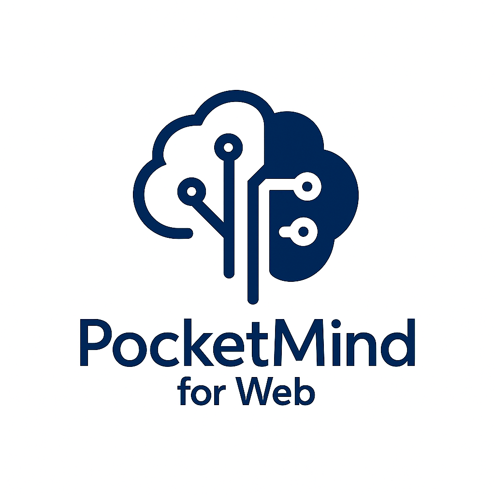

<div align="center">



<h1>🪟 PocketMind for Windows</h1>

<strong>🚀 Windows üzerinde çalışan, Ollama destekli yapay zekâ sohbet uygulaması</strong>


## 🖼️ Sistem İçi Görsel


## 🎥 Tartışma Modu Önizleme

İki yapay zekanın birbirleriyle gerçek zamanlı tartışmasını izleyin! Videoya tıklayarak tartışma modunun nasıl çalıştığını görebilirsiniz:

**🎬 [Tartışma Modu Demo Videosunu İzle →](https://streamable.com/a23aw7)**

> *Video'da iki AI'ın gerçek zamanlı tartışması, rastgele konu seçimi ve tüm özellikler gösterilmektedir.*

**Videoda Gösterilen Özellikler:**
- ⚔️ İki farklı AI modelinin tartışması
- 🎲 Rastgele konu seçimi
- 💬 Sıralı ve akıllı konuşma sistemi
- ♾️ Sonsuz mod seçeneği
- ⏹️ Force stop özelliği
- 🎨 Renkli mesaj kodlaması (AI-1: Mavi, AI-2: Kırmızı)

</div>

<div align="center">

[](#)
[](#)
[](#)
[](#)
[](#)
[](https://opensource.org/licenses/MIT)
[](https://buymeacoffee.com/ismustafakt)

</div>

## 🎯 Ne Sunuyor?

Windows 10+ sistemlerde çalışan, uzak bir Ollama sunucusuna (`http://<ip>:<port>`) bağlanıp sohbet edebileceğiniz, modern ve siyah temalı bir arayüz. Backend varsayılan olarak 4646 portunda çalışır.

### 💬 Normal Sohbet Modu
- IP / Port / Model girerek sohbet başlatma
- Sohbet geçmişi (oturum içinde) tutulur
- Modelleri `/api/tags` ile listeleyebilme (opsiyonel)
- Minimal, siyah temalı ve masaüstü hissiyatı veren arayüz

### ⚔️ Tartışma Modu (YENİ!)
- **İki AI Tartışması**: Farklı AI modelleri birbirleriyle tartışabilir
- **Sıralı Konuşma**: AI'lar teker teker, birbirlerini dinleyerek konuşur
- **Akıllı Kontext**: Her AI önceki konuşmaları hatırlar ve ona göre cevap verir
- **Rastgele Konular**: 50+ hazır tartışma konusu arasından rastgele seçim
- **Sonsuz Mod**: İstediğiniz kadar uzun tartışmalar
- **Force Stop**: Tartışmayı istediğiniz anda durdurabilme
- **Animasyonlu Geçişler**: Smooth mod değiştirme animasyonları
- **Renkli Mesajlar**: AI-1 (mavi) ve AI-2 (kırmızı) renk kodlaması

## 🧩 Mimari

- `backend/` – Node.js + Express
  - `POST /api/chat` → Normal sohbet için Ollama proxy
  - `POST /api/tags` → Model listesi için Ollama proxy
  - `POST /api/debate/start` → Tartışma başlatma (YENİ!)
  - `POST /api/debate/next` → Tartışma devam ettirme (YENİ!)
  - `POST /api/debate/stop` → Tartışma durdurma (YENİ!)
  - `GET /api/debate/history/:id` → Tartışma geçmişi (YENİ!)
- `frontend/` – React + Vite + TailwindCSS + Framer Motion
  - Siyah tema ve Ethereal Shadows animasyonları
  - Responsive tasarım ve smooth geçişler

## 🖥️ Gereksinimler

- Windows 10 veya üzeri
- Node.js (LTS tavsiye edilir)

## 🔧 Kurulum (Windows PowerShell / CMD)

1) Node.js indirin ve kurun: `https://nodejs.org`

2) Proje klasörüne geçin:
```powershell
cd "PocketMind for Windows 3"
```

3) Backend kurulumu:
```powershell
cd backend
npm install
```

4) Frontend kurulumu (ayrı bir terminalde):
```powershell
cd frontend
npm install
```

## ▶️ Çalıştırma

- Backend (4646):
```powershell
cd backend
npm start
```
Alternatif:
```powershell
node server.js
```

- Frontend (Vite dev sunucusu):
```powershell
cd frontend
npm run dev
```

Tarayıcıdan `http://localhost:5173` adresine gidin.

## 🧱 Masaüstü (.exe) Paketleme

Uygulamayı Electron ile Windows için .exe olarak paketleyebilirsiniz. Hem kurulumlu (NSIS) hem de portable üretimi desteklenir.

1) Frontend’i üretim için derleyin:
```powershell
cd frontend
npm run build
```

2) Desktop klasörüne bağımlılıkları yükleyin:
```powershell
cd ../desktop
npm install
```

3) Geliştirme modunda Electron’ı Vite ile birlikte çalıştırma (opsiyonel):
```powershell
# Terminal 1
cd backend
npm start

# Terminal 2
cd frontend
npm run dev

# Terminal 3
cd desktop
npm run dev
```

4) Windows için .exe üretimi:
```powershell
cd desktop
npm run build
```

Çıktılar `desktop/dist/` altına düşer. `Portable` hedefi tek dosyalı taşınabilir çalıştırılabilir üretir; `NSIS` hedefi kurulum sihirbazı üretir.

## 🧪 Kullanım

### Normal Sohbet Modu
1) Arayüzde Sunucu IP, Port ve Model girin (örn. `127.0.0.1` / `11434` / `mistral:latest`)
2) Mesajınızı yazıp gönderin
3) "Modelleri Getir" ile mevcut modelleri listeleyebilirsiniz

### Tartışma Modu
1) **"⚔️ Tartışma Modu"** düğmesine tıklayın
2) **AI-1 Model** ve **AI-2 Model** seçin (aynı veya farklı modeller olabilir)
3) **Maksimum Tur** belirleyin veya **"♾️ Sonsuz"** modunu aktifleştirin
4) İsteğe bağlı olarak:
   - **"🎲 Rastgele Konu"** ile otomatik konu seçimi
   - Manuel olarak kendi konunuzu yazın
5) **"🚀 Tartışmayı Başlat"** ile başlatın
6) AI'lar otomatik olarak sırayla tartışmaya başlar
7) **"⏹️ Force Stop"** ile istediğiniz anda durdurun

## 🎨 UI ve Tema

- **Siyah Tema**: Varsayılan olarak etkinleştirilmiş modern karanlık tema
- **Ethereal Shadows**: Arka planda dinamik gölge/şekil efektleri
- **Animasyon Kontrolü**: "🎭 Anim Kapat/Aç" ile arka plan animasyonlarını kontrol edin
- **Responsive Tasarım**: Farklı ekran boyutlarına uyumlu
- **Smooth Geçişler**: Mod değiştirirken akıcı animasyonlar
- **Renkli Kodlama**: Tartışma modunda AI'lar için farklı renkler (mavi/kırmızı)

## 🆕 Yeni Özellikler (v2.0)

### ⚔️ Tartışma Modu
- **Çift AI Sistemi**: İki farklı AI modeli birbirleriyle tartışabilir
- **Backend Kontrollü**: Güvenilir tartışma yönetimi için backend tabanlı sistem
- **Akıllı Konuşma**: AI'lar birbirlerinin mesajlarını hatırlar ve ona göre cevap verir
- **50+ Rastgele Konu**: Çeşitli tartışma konuları arasından otomatik seçim
- **Sonsuz Mod**: Sınırsız tartışma imkanı
- **Gerçek Zamanlı Durdurma**: Force stop ile anında müdahale

### 🎭 Animasyon Sistemi
- **Framer Motion**: Profesyonel animasyon kütüphanesi entegrasyonu
- **Smooth Geçişler**: Mod değiştirirken akıcı animasyonlar
- **Ethereal Shadows**: Arka plan için dinamik efektler
- **Animasyon Kontrolü**: Kullanıcı tercihi ile açma/kapama

### 🔧 Teknik İyileştirmeler
- **Backend API Genişletildi**: Tartışma yönetimi için yeni endpoint'ler
- **State Yönetimi**: Daha güvenilir durum kontrolü
- **Error Handling**: Gelişmiş hata yönetimi ve kullanıcı bildirimleri
- **Debug Sistemi**: Geliştirici dostu log sistemi

## 👤 Devoloper

**Mustafa Kemal ÇINGIL**
- LinkedIn: [mustafakemalcingil](https://www.linkedin.com/in/mustafakemalcingil/)
- GitHub: [@MustafaKemal0146](https://github.com/MustafaKemal0146)

## ⭐ Destek

Eğer bu proje işinizi kolaylaştırdıysa:
- ⭐ Yıldızlayın
- 🔄 Ekibinizle paylaşın
- ☕ Destek olmak için: [Buy Me A Coffee](https://buymeacoffee.com/ismustafakt)

<div align="center">

<em>Made with ❤️ for Windows AI chat experiences</em>


</div>


